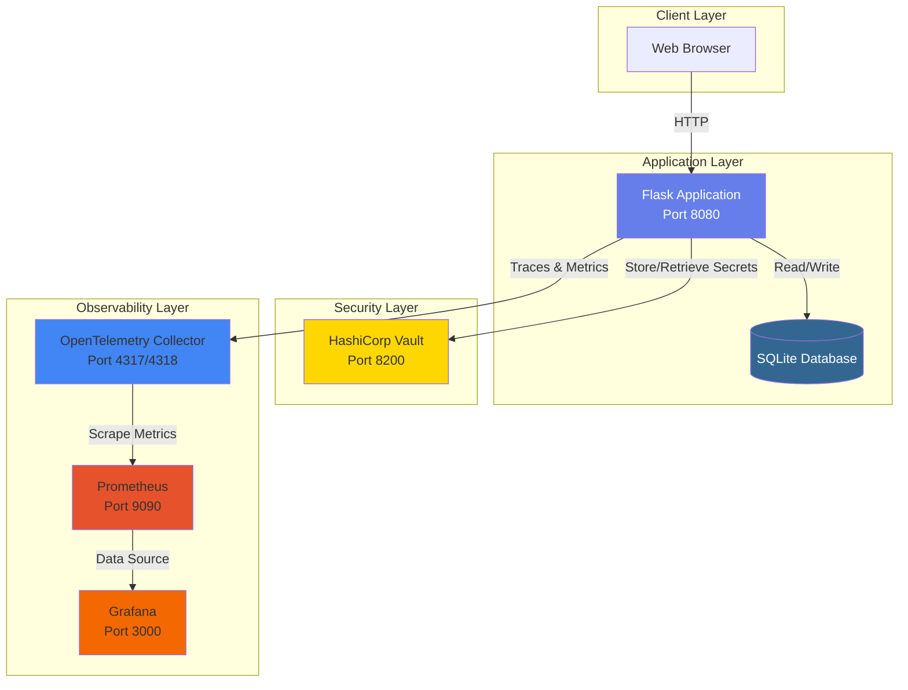
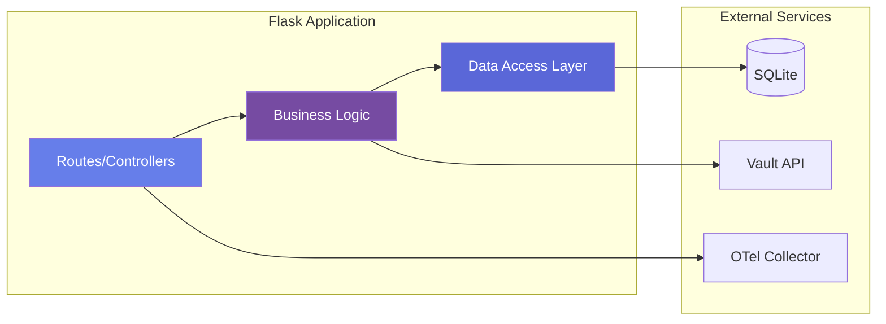
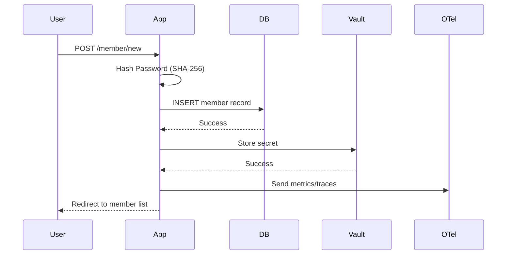
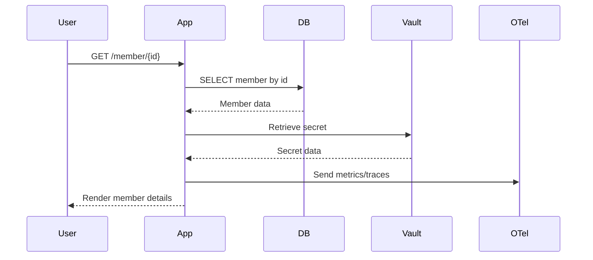
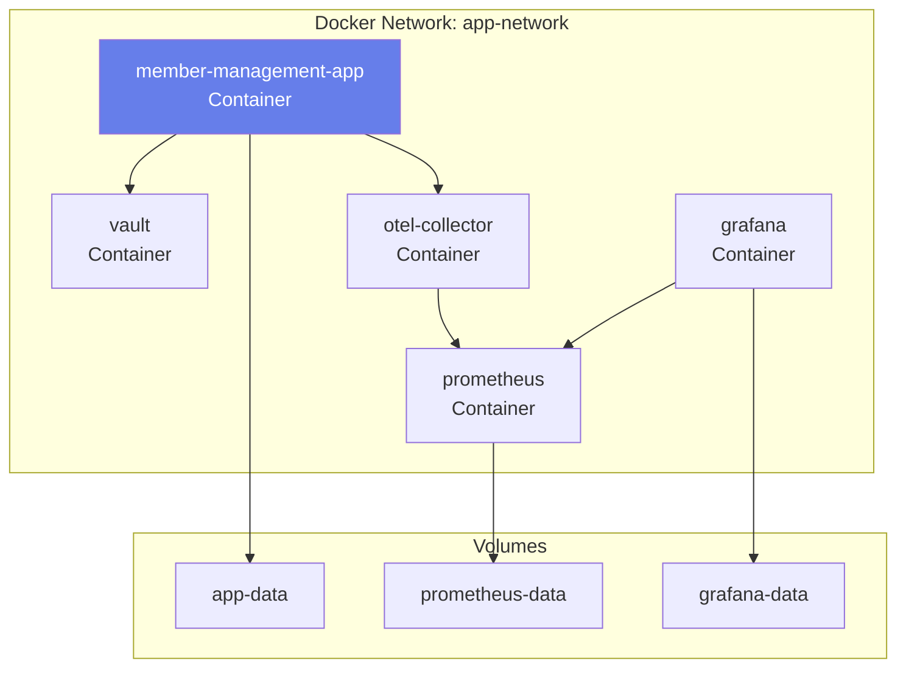
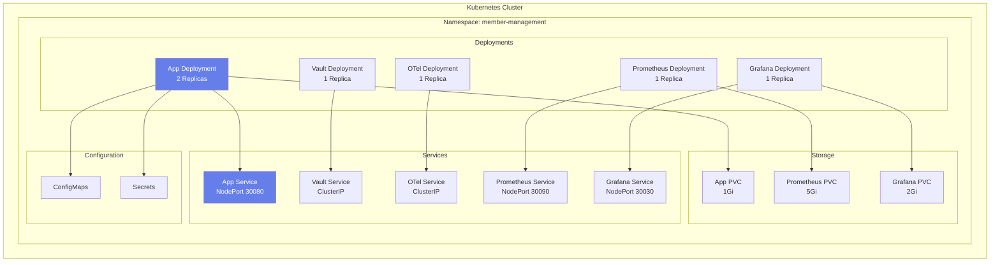
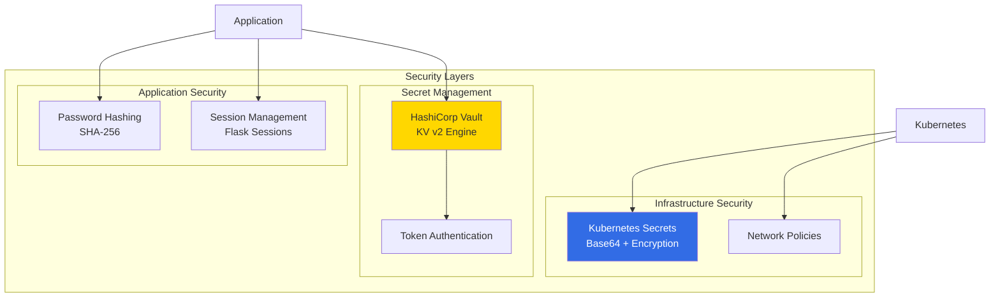
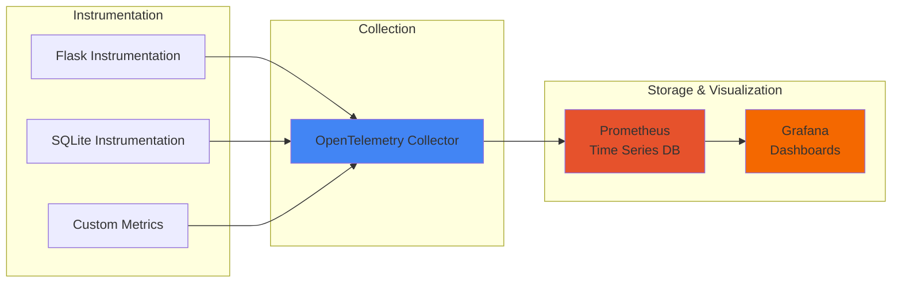
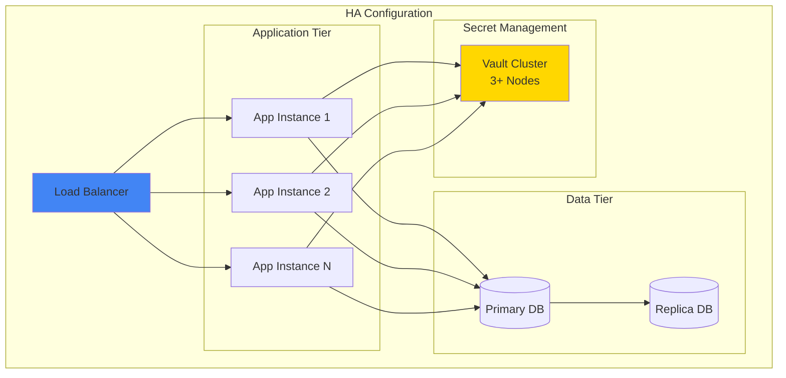

# Architecture Documentation

## System Architecture

### Overview

The Member Management Application follows a microservices-inspired architecture with clear separation of concerns. The system is designed to be cloud-native, observable, and secure.

## Architecture Diagram

## Component Architecture

## Data Flow

### Member Creation Flow

### Member Retrieval Flow

## Deployment Architecture

### Docker Compose Deployment

### Kubernetes Deployment

## Security Architecture

## Observability Architecture

## Technology Stack

### Application Layer
- **Framework**: Flask 3.0.0
- **Language**: Python 3.11
- **Database**: SQLite 3
- **Template Engine**: Jinja2

### Security
- **Secret Management**: HashiCorp Vault
- **Password Hashing**: SHA-256
- **Authentication**: Token-based (Vault)

### Observability
- **Instrumentation**: OpenTelemetry
- **Metrics Collection**: OpenTelemetry Collector
- **Metrics Storage**: Prometheus
- **Visualization**: Grafana

### Infrastructure
- **Containerization**: Docker
- **Orchestration**: Kubernetes
- **IaC**: Terraform
- **Configuration Management**: Ansible

## Scalability Considerations

### Horizontal Scaling
- Application pods can be scaled horizontally in Kubernetes
- Load balancing handled by Kubernetes Service
- Stateless application design (except database)

### Database Considerations
- SQLite suitable for development and small deployments
- For production at scale, consider:
  - PostgreSQL or MySQL for better concurrency
  - Database replication for high availability
  - Connection pooling

### Caching Strategy
- Consider adding Redis for session storage
- Implement caching layer for frequently accessed data
- Use CDN for static assets

## High Availability

## Disaster Recovery

### Backup Strategy
1. **Database Backups**
   - Automated daily backups
   - Point-in-time recovery capability
   - Off-site backup storage

2. **Vault Backups**
   - Regular snapshots of Vault data
   - Encrypted backup storage
   - Tested restore procedures

3. **Configuration Backups**
   - Version-controlled infrastructure code
   - ConfigMap and Secret backups
   - Documentation of manual configurations

### Recovery Procedures
1. Database restoration from backup
2. Vault unsealing and data restoration
3. Application redeployment
4. Verification and testing

## Performance Optimization

### Application Level
- Connection pooling for database
- Caching frequently accessed data
- Async operations where applicable
- Query optimization

### Infrastructure Level
- Resource limits and requests properly configured
- Horizontal Pod Autoscaling (HPA)
- Persistent volume performance tuning
- Network optimization

## Monitoring and Alerting

### Key Metrics
- Request rate and latency
- Error rate
- Database query performance
- Resource utilization (CPU, Memory)
- Vault availability

### Alert Conditions
- High error rate (>5%)
- Slow response time (>2s)
- Database connection failures
- Vault unavailability
- Resource exhaustion

## Future Enhancements

1. **Authentication & Authorization**
   - Implement user authentication
   - Role-based access control (RBAC)
   - OAuth2/OIDC integration

2. **API Layer**
   - RESTful API endpoints
   - API documentation (OpenAPI/Swagger)
   - Rate limiting

3. **Advanced Features**
   - Audit logging
   - Data encryption at rest
   - Multi-tenancy support
   - Advanced search and filtering

4. **Infrastructure**
   - Multi-region deployment
   - Service mesh (Istio)
   - GitOps workflow (ArgoCD)
   - Advanced monitoring (Distributed tracing)