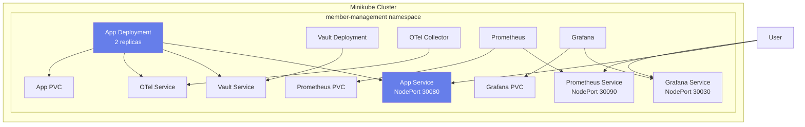

# Kubernetes Deployment Guide

This guide covers deploying the Member Management Application to a Kubernetes cluster, specifically Minikube for local development.

## Prerequisites

- Minikube 1.25+ installed
- kubectl 1.24+ installed
- Docker 20.10+ installed
- At least 4GB RAM available for Minikube

## Quick Start

### Using the Deployment Script

The easiest way to deploy is using the provided script:

```bash
./scripts/deploy-k8s.sh
```

This script will:
1. Start Minikube if not running
2. Build the Docker image
3. Load the image into Minikube
4. Apply all Kubernetes manifests
5. Wait for all pods to be ready
6. Display access URLs

### Manual Deployment

If you prefer manual deployment:

```bash
# Start Minikube
minikube start

# Build and load Docker image
docker build -t member-management-app:latest .
minikube image load member-management-app:latest

# Apply manifests
kubectl apply -f k8s/namespace.yaml
kubectl apply -f k8s/configmap.yaml
kubectl apply -f k8s/secrets.yaml
kubectl apply -f k8s/pvc.yaml
kubectl apply -f k8s/vault-deployment.yaml
kubectl apply -f k8s/otel-collector-deployment.yaml
kubectl apply -f k8s/prometheus-deployment.yaml
kubectl apply -f k8s/grafana-deployment.yaml
kubectl apply -f k8s/app-deployment.yaml

# Get Minikube IP
minikube ip
```

## Architecture



## Kubernetes Resources

### Namespace

All resources are deployed in the `member-management` namespace for isolation.

```yaml
apiVersion: v1
kind: Namespace
metadata:
  name: member-management
```

### ConfigMaps

- `app-config`: Application configuration
- `otel-collector-config`: OpenTelemetry Collector configuration
- `prometheus-config`: Prometheus scrape configuration
- `grafana-datasources`: Grafana data source configuration

### Secrets

- `app-secrets`: Contains sensitive data like Vault token and Flask secret key

### Persistent Volume Claims

- `app-data-pvc`: 1Gi for application database
- `prometheus-data-pvc`: 5Gi for Prometheus time-series data
- `grafana-data-pvc`: 2Gi for Grafana dashboards and settings

### Deployments

1. **member-management-app**
   - 2 replicas for high availability
   - Resource limits: 512Mi memory, 500m CPU
   - Health checks configured
   - Mounts app-data PVC

2. **vault**
   - 1 replica (dev mode)
   - IPC_LOCK capability for memory locking
   - ClusterIP service

3. **otel-collector**
   - 1 replica
   - Receives traces and metrics
   - Exports to Prometheus

4. **prometheus**
   - 1 replica
   - Scrapes metrics from OTel Collector
   - NodePort service (30090)
   - Mounts prometheus-data PVC

5. **grafana**
   - 1 replica
   - Pre-configured with Prometheus data source
   - NodePort service (30030)
   - Mounts grafana-data PVC

### Services

- **member-management-app**: NodePort 30080
- **vault**: ClusterIP (internal only)
- **otel-collector**: ClusterIP (internal only)
- **prometheus**: NodePort 30090
- **grafana**: NodePort 30030

## Accessing the Application

### Get Minikube IP

```bash
minikube ip
```

### Access URLs

Replace `<MINIKUBE_IP>` with the IP from the command above:

- Application: `http://<MINIKUBE_IP>:30080`
- Prometheus: `http://<MINIKUBE_IP>:30090`
- Grafana: `http://<MINIKUBE_IP>:30030`

### Grafana Login

- Username: `admin`
- Password: `admin`

## Monitoring and Troubleshooting

### View All Resources

```bash
kubectl get all -n member-management
```

### Check Pod Status

```bash
kubectl get pods -n member-management
```

### View Pod Logs

```bash
# Application logs
kubectl logs -f deployment/member-management-app -n member-management

# Vault logs
kubectl logs -f deployment/vault -n member-management

# Prometheus logs
kubectl logs -f deployment/prometheus -n member-management

# Grafana logs
kubectl logs -f deployment/grafana -n member-management
```

### Describe Resources

```bash
# Describe a pod
kubectl describe pod <pod-name> -n member-management

# Describe a deployment
kubectl describe deployment member-management-app -n member-management

# Describe a service
kubectl describe service member-management-app -n member-management
```

### Execute Commands in Pods

```bash
# Get a shell in the app pod
kubectl exec -it deployment/member-management-app -n member-management -- /bin/bash

# Check database
kubectl exec -it deployment/member-management-app -n member-management -- sqlite3 /data/members.db ".tables"
```

### Check Events

```bash
kubectl get events -n member-management --sort-by='.lastTimestamp'
```

## Scaling

### Scale Application

```bash
# Scale to 3 replicas
kubectl scale deployment member-management-app --replicas=3 -n member-management

# Verify scaling
kubectl get pods -n member-management -l app=member-management-app
```

### Horizontal Pod Autoscaler (Optional)

```bash
# Create HPA based on CPU usage
kubectl autoscale deployment member-management-app \
  --cpu-percent=70 \
  --min=2 \
  --max=5 \
  -n member-management

# Check HPA status
kubectl get hpa -n member-management
```

## Updates and Rollouts

### Update Application Image

```bash
# Build new image
docker build -t member-management-app:v2 .

# Load into Minikube
minikube image load member-management-app:v2

# Update deployment
kubectl set image deployment/member-management-app \
  app=member-management-app:v2 \
  -n member-management

# Check rollout status
kubectl rollout status deployment/member-management-app -n member-management
```

### Rollback

```bash
# View rollout history
kubectl rollout history deployment/member-management-app -n member-management

# Rollback to previous version
kubectl rollout undo deployment/member-management-app -n member-management

# Rollback to specific revision
kubectl rollout undo deployment/member-management-app --to-revision=2 -n member-management
```

## Backup and Restore

### Backup Database

```bash
# Copy database from pod
kubectl cp member-management/$(kubectl get pod -n member-management -l app=member-management-app -o jsonpath='{.items[0].metadata.name}'):/data/members.db ./backup-members.db
```

### Restore Database

```bash
# Copy database to pod
kubectl cp ./backup-members.db member-management/$(kubectl get pod -n member-management -l app=member-management-app -o jsonpath='{.items[0].metadata.name}'):/data/members.db

# Restart pods to pick up changes
kubectl rollout restart deployment/member-management-app -n member-management
```

## Cleanup

### Using the Script

```bash
./scripts/undeploy-k8s.sh
```

### Manual Cleanup

```bash
# Delete all resources
kubectl delete -f k8s/app-deployment.yaml
kubectl delete -f k8s/grafana-deployment.yaml
kubectl delete -f k8s/prometheus-deployment.yaml
kubectl delete -f k8s/otel-collector-deployment.yaml
kubectl delete -f k8s/vault-deployment.yaml
kubectl delete -f k8s/pvc.yaml
kubectl delete -f k8s/secrets.yaml
kubectl delete -f k8s/configmap.yaml
kubectl delete -f k8s/namespace.yaml

# Or delete entire namespace (faster)
kubectl delete namespace member-management
```

### Stop Minikube

```bash
minikube stop
```

### Delete Minikube Cluster

```bash
minikube delete
```

## Production Considerations

### Security

1. **Change Default Credentials**
   - Update Vault token in secrets
   - Change Grafana admin password
   - Use strong Flask secret key

2. **Use Production Vault**
   - Deploy Vault in production mode
   - Enable TLS
   - Configure proper authentication

3. **Network Policies**
   - Implement network policies to restrict pod communication
   - Use ingress controller with TLS

### High Availability

1. **Database**
   - Replace SQLite with PostgreSQL or MySQL
   - Configure database replication
   - Use managed database service

2. **Vault**
   - Deploy Vault cluster (3+ nodes)
   - Configure auto-unseal
   - Set up backup strategy

3. **Application**
   - Increase replica count
   - Configure pod disruption budgets
   - Use anti-affinity rules

### Monitoring

1. **Enhanced Observability**
   - Add distributed tracing
   - Configure alerting rules
   - Set up log aggregation (ELK/Loki)

2. **Resource Management**
   - Fine-tune resource requests and limits
   - Monitor resource usage
   - Implement autoscaling

### Storage

1. **Persistent Volumes**
   - Use appropriate storage class for production
   - Configure backup policies
   - Monitor storage usage

2. **Database Backups**
   - Automated backup schedule
   - Off-site backup storage
   - Test restore procedures

## Troubleshooting Common Issues

### Pods Not Starting

```bash
# Check pod status
kubectl get pods -n member-management

# Describe pod for events
kubectl describe pod <pod-name> -n member-management

# Check logs
kubectl logs <pod-name> -n member-management
```

### Image Pull Errors

```bash
# Verify image is loaded in Minikube
minikube image ls | grep member-management-app

# Reload image if needed
minikube image load member-management-app:latest
```

### Service Not Accessible

```bash
# Check service
kubectl get svc -n member-management

# Verify endpoints
kubectl get endpoints -n member-management

# Test from within cluster
kubectl run -it --rm debug --image=busybox --restart=Never -n member-management -- wget -O- http://member-management-app:8080/health
```

### PVC Issues

```bash
# Check PVC status
kubectl get pvc -n member-management

# Describe PVC
kubectl describe pvc app-data-pvc -n member-management

# Check storage class
kubectl get storageclass
```

## Additional Resources

- [Kubernetes Documentation](https://kubernetes.io/docs/)
- [Minikube Documentation](https://minikube.sigs.k8s.io/docs/)
- [kubectl Cheat Sheet](https://kubernetes.io/docs/reference/kubectl/cheatsheet/)