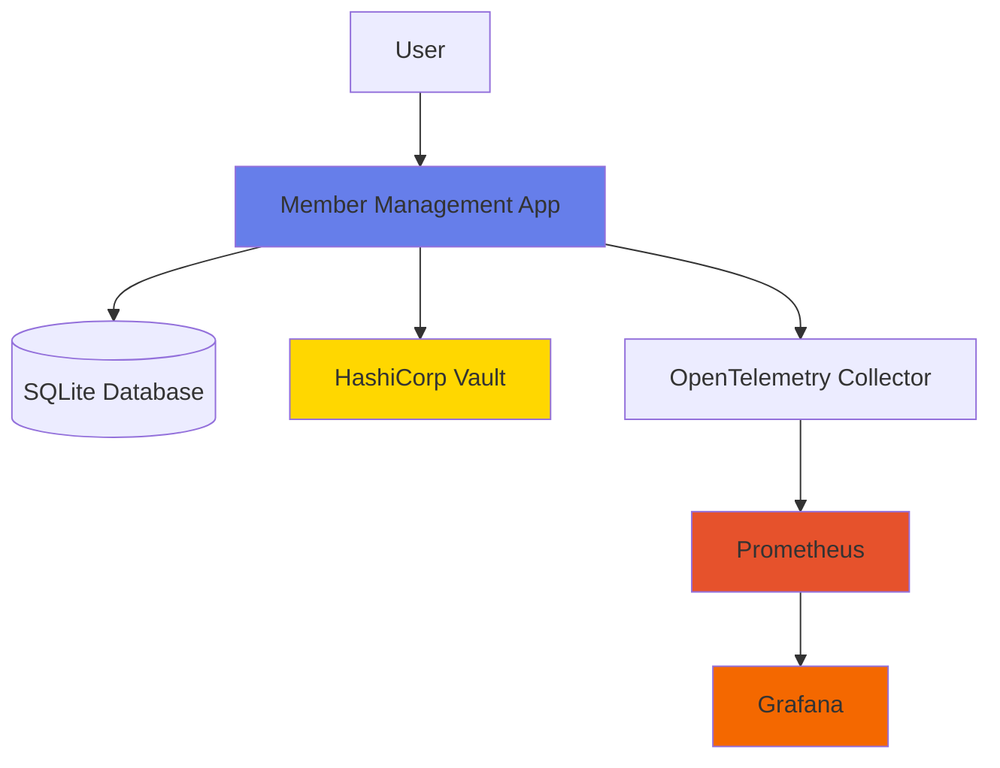

# Member Management Application

A comprehensive member management system with secure password and secret storage using HashiCorp Vault, OpenTelemetry instrumentation, and full Kubernetes deployment support.

## Table of Contents

- [Overview](#overview)
- [Features](#features)
- [Architecture](#architecture)
- [Prerequisites](#prerequisites)
- [Quick Start](#quick-start)
- [Deployment Options](#deployment-options)
- [Configuration](#configuration)
- [Monitoring](#monitoring)
- [Security](#security)
- [Development](#development)
- [Troubleshooting](#troubleshooting)

## Overview

The Member Management Application is a production-ready web application built with Flask that provides CRUD operations for managing member records. It integrates with HashiCorp Vault for secure secret storage and implements OpenTelemetry for comprehensive observability.

## Features

- **Member Management**: Create, read, update, and delete member records
- **Secure Storage**: Passwords hashed with SHA-256, secrets stored in HashiCorp Vault
- **Database**: SQLite database with 5 pre-populated sample records
- **Observability**: Full OpenTelemetry instrumentation with Prometheus and Grafana
- **Containerization**: Docker and Docker Compose support
- **Kubernetes Ready**: Complete K8s manifests and Helm-ready configuration
- **Infrastructure as Code**: Terraform scripts for automated deployment
- **Automation**: Ansible playbooks for lifecycle management
- **Modern UI**: Clean, responsive web interface

## Architecture

See [Architecture Documentation](./ARCHITECTURE.md) for detailed architecture diagrams and component descriptions.

### High-Level Architecture



## Prerequisites

### For Docker Compose Deployment
- Docker 20.10+
- Docker Compose 2.0+

### For Kubernetes Deployment
- Minikube 1.25+ or any Kubernetes cluster
- kubectl 1.24+
- Docker 20.10+

### For Terraform Deployment
- Terraform 1.0+
- Minikube 1.25+
- kubectl 1.24+

### For Ansible Deployment
- Ansible 2.9+
- Python 3.8+
- kubernetes Python module

## Quick Start

### Using Docker Compose (Recommended for Development)

1. Clone the repository:
```bash
git clone <repository-url>
cd member-management-app
```

2. Start the application:
```bash
./scripts/start.sh
```

3. Access the application:
- Application: http://localhost:8080
- Vault: http://localhost:8200
- Prometheus: http://localhost:9090
- Grafana: http://localhost:3000 (admin/admin)

4. Stop the application:
```bash
./scripts/stop.sh
```

5. Complete cleanup (remove all Docker resources):
```bash
./scripts/cleanup.sh
```

## Deployment Options

### 1. Docker Compose

See [Docker Compose Guide](./DOCKER_COMPOSE.md) for detailed instructions.

```bash
# Start all services
./scripts/start.sh

# Stop all services
./scripts/stop.sh

# View logs
docker-compose logs -f

# Complete cleanup (remove all Docker resources)
./scripts/cleanup.sh
```

**Cleanup Script Details:**

The cleanup script (`./scripts/cleanup.sh`) performs a complete removal of all Docker resources:
- Stops and removes all running containers
- Removes all Docker images (application, Vault, Prometheus, Grafana, OpenTelemetry)
- Removes all Docker volumes
- Removes all Docker networks
- Cleans up dangling images and build cache
- Displays remaining Docker resources

⚠️ **Warning**: This is a destructive operation. All data will be lost. Use with caution.

### 2. Kubernetes (Minikube)

See [Kubernetes Deployment Guide](./KUBERNETES.md) for detailed instructions.

```bash
# Deploy to Kubernetes
./scripts/deploy-k8s.sh

# Undeploy from Kubernetes
./scripts/undeploy-k8s.sh
```

### 3. Terraform

See [Terraform Guide](./TERRAFORM.md) for detailed instructions.

```bash
cd Terraform
terraform init
terraform plan
terraform apply
```

### 4. Ansible

See [Ansible Guide](./ANSIBLE.md) for detailed instructions.

```bash
# Deploy
ansible-playbook -i Ansible/inventory.yml Ansible/deploy.yml

# Update
ansible-playbook -i Ansible/inventory.yml Ansible/update.yml

# Undeploy
ansible-playbook -i Ansible/inventory.yml Ansible/undeploy.yml
```

## Configuration

### Environment Variables

| Variable | Description | Default |
|----------|-------------|---------|
| `DATABASE_PATH` | Path to SQLite database | `/data/members.db` |
| `PORT` | Application port | `8080` |
| `VAULT_ADDR` | Vault server address | `http://localhost:8200` |
| `VAULT_TOKEN` | Vault authentication token | `dev-token` |
| `VAULT_MOUNT_POINT` | Vault secret mount point | `secret` |
| `OTEL_EXPORTER_OTLP_ENDPOINT` | OpenTelemetry collector endpoint | `http://localhost:4317` |
| `FLASK_SECRET_KEY` | Flask session secret key | `dev-secret-key` |

### Database Schema

```sql
CREATE TABLE members (
    id INTEGER PRIMARY KEY AUTOINCREMENT,
    last_name TEXT NOT NULL,
    first_name TEXT NOT NULL,
    date_of_birth TEXT NOT NULL,
    username TEXT UNIQUE NOT NULL,
    password_hash TEXT NOT NULL,
    created_at TIMESTAMP DEFAULT CURRENT_TIMESTAMP,
    updated_at TIMESTAMP DEFAULT CURRENT_TIMESTAMP
);
```

## Monitoring

### Prometheus Metrics

The application exposes the following metrics:
- `member_management_member_operations_total`: Counter for member operations (create, read, update, delete)
- Standard OpenTelemetry metrics for HTTP requests, database queries, and system resources

### Grafana Dashboards

Pre-configured dashboards are available at http://localhost:3000 (or NodePort 30030 in Kubernetes):
- Member Operations Dashboard
- System Metrics Dashboard
- Application Performance Dashboard

Default credentials: `admin/admin`

## Security

### Password Security
- Passwords are hashed using SHA-256 before storage
- Never stored in plain text in the database

### Secret Management
- Secrets stored in HashiCorp Vault
- Vault runs in dev mode for development (use production mode for production)
- Secrets encrypted at rest and in transit

### Kubernetes Secrets
- Sensitive configuration stored in Kubernetes Secrets
- Base64 encoded and encrypted by Kubernetes

## Development

### Local Development Setup

1. Create a virtual environment:
```bash
python -m venv venv
source venv/bin/activate  # On Windows: venv\Scripts\activate
```

2. Install dependencies:
```bash
pip install -r requirements.txt
```

3. Run the application:
```bash
python app.py
```

### Running Tests

```bash
# Unit tests
pytest tests/

# Integration tests
pytest tests/integration/
```

### Building Docker Image

```bash
docker build -t member-management-app:latest .
```

## Troubleshooting

### Common Issues

1. **Port 8080 already in use**
   - Change the port in docker-compose.yml or set PORT environment variable

2. **Vault connection failed**
   - Ensure Vault is running and accessible
   - Check VAULT_ADDR and VAULT_TOKEN environment variables

3. **Database locked error**
   - Ensure only one instance is accessing the database
   - Check file permissions on the database file

4. **Kubernetes pods not starting**
   - Check pod logs: `kubectl logs -f <pod-name> -n member-management`
   - Verify image is loaded: `minikube image ls`

### Logs

```bash
# Docker Compose
docker-compose logs -f [service-name]

# Kubernetes
kubectl logs -f deployment/member-management-app -n member-management

# View all pods
kubectl get pods -n member-management
```

### Complete Cleanup

If you need to completely remove all Docker resources:

```bash
./scripts/cleanup.sh
```

This will remove:
- All containers (running and stopped)
- All images related to the application
- All volumes
- All networks
- Dangling images and build cache

⚠️ **Warning**: This operation is irreversible. All data will be permanently deleted.

## Contributing

1. Fork the repository
2. Create a feature branch
3. Make your changes
4. Submit a pull request

## License

This project is licensed under the MIT License - see the LICENSE file for details.

## Support

For issues and questions:
- Create an issue in the repository
- Check the [Troubleshooting](#troubleshooting) section
- Review the detailed documentation in the Docs folder