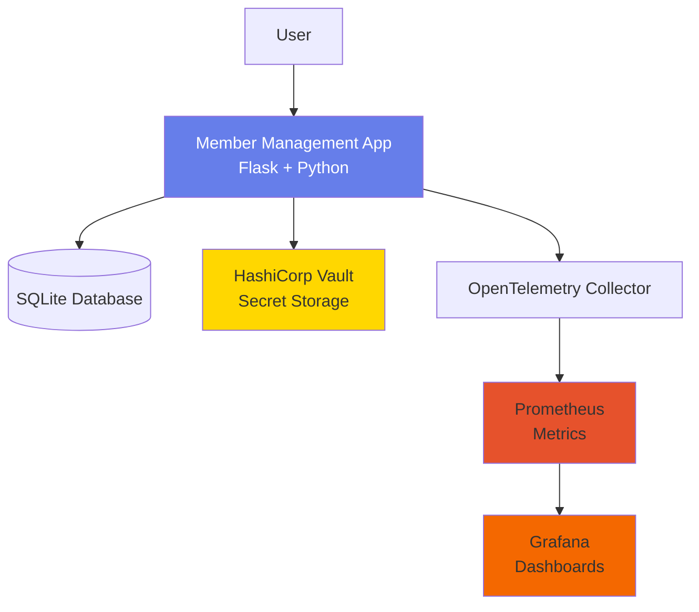

# Member Management Application

A production-ready member management system with secure password and secret storage using HashiCorp Vault, comprehensive OpenTelemetry instrumentation, and full Kubernetes deployment support.


## 🚀 Quick Start

### Using Docker Compose (Recommended)

```bash
# Start the application
./scripts/start.sh

# Access at http://localhost:8080
```

### Using Kubernetes

```bash
# Deploy to Minikube
./scripts/deploy-k8s.sh

# Access at http://$(minikube ip):30080
```

## ✨ Features

- ✅ **Full CRUD Operations** - Create, Read, Update, Delete member records
- 🔐 **Secure Storage** - Passwords hashed with SHA-256, secrets in HashiCorp Vault
- 📊 **Complete Observability** - OpenTelemetry with Prometheus & Grafana
- 🐳 **Containerized** - Docker and Docker Compose ready
- ☸️ **Kubernetes Native** - Complete K8s manifests included
- 🏗️ **Infrastructure as Code** - Terraform scripts for automated deployment
- 🤖 **Automation** - Ansible playbooks for lifecycle management
- 🎨 **Modern UI** - Clean, responsive web interface
- 📦 **Pre-populated Data** - 5 sample member records included

## 📋 Table of Contents

- [Architecture](#architecture)
- [Prerequisites](#prerequisites)
- [Installation](#installation)
- [Usage](#usage)
- [Deployment](#deployment)
- [Monitoring](#monitoring)
- [Documentation](#documentation)
- [Contributing](#contributing)

## 🏗️ Architecture



See [Architecture Documentation](./Docs/ARCHITECTURE.md) for detailed diagrams and explanations.

## 📦 Prerequisites

### For Docker Compose
- Docker 20.10+
- Docker Compose 2.0+

### For Kubernetes
- Minikube 1.25+ or any Kubernetes cluster
- kubectl 1.24+
- Docker 20.10+

### For Development
- Python 3.11+
- pip

## 🔧 Installation

### Initialize and Push to GitHub

If you want to push this project to your own GitHub repository:

```bash
# Initialize git and push to GitHub
./scripts/init-github.sh https://github.com/username/repo.git "Initial commit"
```

The script will:
- Initialize git repository (if not already initialized)
- Add all files to git
- Commit with your message
- Push to your GitHub repository
- Handle conflicts automatically

### Complete Cleanup

To remove all Docker resources (containers, images, volumes, networks) related to the application:

```bash
./scripts/cleanup.sh
```

This script will:
- Stop and remove all running containers
- Remove all Docker images (application, Vault, Prometheus, Grafana, OpenTelemetry)
- Remove all Docker volumes
- Remove all Docker networks
- Clean up dangling images and build cache
- Display remaining Docker resources

⚠️ **Warning**: This is a destructive operation. All data will be lost. Use with caution.

### Clone the Repository

```bash
git clone <repository-url>
cd member-management-app
```

### Local Development Setup

```bash
# Create virtual environment
python -m venv venv
source venv/bin/activate  # On Windows: venv\Scripts\activate

# Install dependencies
pip install -r requirements.txt

# Run the application
python app.py
```

## 🎯 Usage

### Access the Application

- **Application UI**: http://localhost:8080
- **Admin Dashboard**: http://localhost:8080/admin (Access all monitoring tools with credentials)
- **Prometheus**: http://localhost:9090 (No authentication required)
- **Grafana**: http://localhost:3000 (Username: `admin`, Password: `admin`)
- **Vault**: http://localhost:8200 (Token: `dev-token`)

### Admin Dashboard

The application includes a dedicated **Admin Dashboard** accessible at http://localhost:8080/admin that provides:

- 📊 **Grafana** - Visualization and monitoring dashboards
  - Username: `admin`
  - Password: `admin`
  - URL: http://localhost:3000

- 📈 **Prometheus** - Metrics collection and querying
  - No authentication required
  - URL: http://localhost:9090

- 🔐 **HashiCorp Vault** - Secret management system
  - Token: `dev-token`
  - URL: http://localhost:8200

- 📡 **Application Metrics** - Direct metrics endpoint
  - URL: http://localhost:8080/metrics

⚠️ **Security Notice**: These are default credentials for the sample application. Change them before production deployment!

### Member Operations

1. **View Members**: Navigate to the home page to see all members
2. **Add Member**: Click "Add New Member" and fill in the form
3. **View Details**: Click "View" on any member to see full details including secrets
4. **Edit Member**: Click "Edit" to modify member information
5. **Delete Member**: Click "Delete" to remove a member (with confirmation)

### Sample Members

The application comes with 5 pre-populated members:
- John Smith (jsmith)
- Emily Johnson (ejohnson)
- Michael Williams (mwilliams)
- Sarah Brown (sbrown)
- Robert Davis (rdavis)

## 🚢 Deployment

### Docker Compose

```bash
# Start all services
./scripts/start.sh

# Stop all services
./scripts/stop.sh

# View logs
docker-compose logs -f

# Complete cleanup (remove all Docker resources)
./scripts/cleanup.sh
```

### Kubernetes (Minikube)

```bash
# Deploy
./scripts/deploy-k8s.sh

# Undeploy
./scripts/undeploy-k8s.sh

# View pods
kubectl get pods -n member-management
```

### Terraform

```bash
cd Terraform
terraform init
terraform plan
terraform apply

# Get outputs
terraform output
```

### Ansible

```bash
# Deploy
ansible-playbook -i Ansible/inventory.yml Ansible/deploy.yml

# Update
ansible-playbook -i Ansible/inventory.yml Ansible/update.yml

# Undeploy
ansible-playbook -i Ansible/inventory.yml Ansible/undeploy.yml
```

## 📊 Monitoring

### Prometheus Metrics

Access Prometheus at http://localhost:9090 to query metrics:

```promql
# Member operations rate
rate(member_management_member_operations_total[5m])

# Total operations by type
sum(member_management_member_operations_total) by (operation)
```

### Grafana Dashboards

Access Grafana at http://localhost:3000 (admin/admin) to view:
- Member Operations Dashboard
- System Metrics
- Application Performance

## 📚 Documentation

Comprehensive documentation is available in the `Docs/` folder:

- [**README.md**](./Docs/README.md) - Complete user guide
- [**ARCHITECTURE.md**](./Docs/ARCHITECTURE.md) - Architecture diagrams and design decisions
- [**KUBERNETES.md**](./Docs/KUBERNETES.md) - Kubernetes deployment guide

## 🔒 Security

- **Passwords**: Hashed using SHA-256 before storage
- **Secrets**: Stored securely in HashiCorp Vault
- **Vault**: Runs in dev mode for development (use production mode for production)
- **Kubernetes Secrets**: Base64 encoded and encrypted by Kubernetes

⚠️ **Important**: Change default credentials before production deployment!

## 🛠️ Technology Stack

| Component | Technology |
|-----------|-----------|
| **Backend** | Python 3.11, Flask 3.0 |
| **Database** | SQLite 3 |
| **Secret Management** | HashiCorp Vault |
| **Observability** | OpenTelemetry, Prometheus, Grafana |
| **Containerization** | Docker, Docker Compose |
| **Orchestration** | Kubernetes |
| **IaC** | Terraform |
| **Automation** | Ansible |

## 📁 Project Structure

```
.
├── app.py                      # Main Flask application
├── requirements.txt            # Python dependencies
├── Dockerfile                  # Docker image definition
├── docker-compose.yml          # Docker Compose configuration
├── templates/                  # HTML templates
│   ├── base.html
│   ├── index.html
│   ├── admin.html
│   ├── view_member.html
│   ├── create_member.html
│   └── edit_member.html
├── k8s/                        # Kubernetes manifests
│   ├── namespace.yaml
│   ├── configmap.yaml
│   ├── secrets.yaml
│   ├── pvc.yaml
│   ├── app-deployment.yaml
│   ├── vault-deployment.yaml
│   ├── otel-collector-deployment.yaml
│   ├── prometheus-deployment.yaml
│   └── grafana-deployment.yaml
├── Terraform/                  # Terraform scripts
│   ├── main.tf
│   ├── deployments.tf
│   ├── variables.tf
│   └── outputs.tf
├── Ansible/                    # Ansible playbooks
│   ├── inventory.yml
│   ├── deploy.yml
│   ├── update.yml
│   └── undeploy.yml
├── scripts/                    # Utility scripts
│   ├── start.sh                # Start application with Docker Compose
│   ├── stop.sh                 # Stop application
│   ├── deploy-k8s.sh           # Deploy to Kubernetes
│   ├── undeploy-k8s.sh         # Remove from Kubernetes
│   ├── init-github.sh          # Initialize and push to GitHub
│   └── cleanup.sh              # Complete cleanup of Docker resources
└── Docs/                       # Documentation
    ├── README.md
    ├── ARCHITECTURE.md
    └── KUBERNETES.md
```

## 🤝 Contributing

Contributions are welcome! Please feel free to submit a Pull Request.

1. Fork the repository
2. Create your feature branch (`git checkout -b feature/AmazingFeature`)
3. Commit your changes (`git commit -m 'Add some AmazingFeature'`)
4. Push to the branch (`git push origin feature/AmazingFeature`)
5. Open a Pull Request

## 📝 License

This project is licensed under the MIT License - see the LICENSE file for details.

## 🙏 Acknowledgments

- Flask framework for the web application
- HashiCorp Vault for secret management
- OpenTelemetry for observability
- Prometheus and Grafana for monitoring
- Kubernetes community for orchestration tools

## 📞 Support

For issues and questions:
- Create an issue in the repository
- Check the [Documentation](./Docs/)
- Review the [Troubleshooting](./Docs/README.md#troubleshooting) section

---

**Built with ❤️ using Python, Flask, and Cloud-Native Technologies**